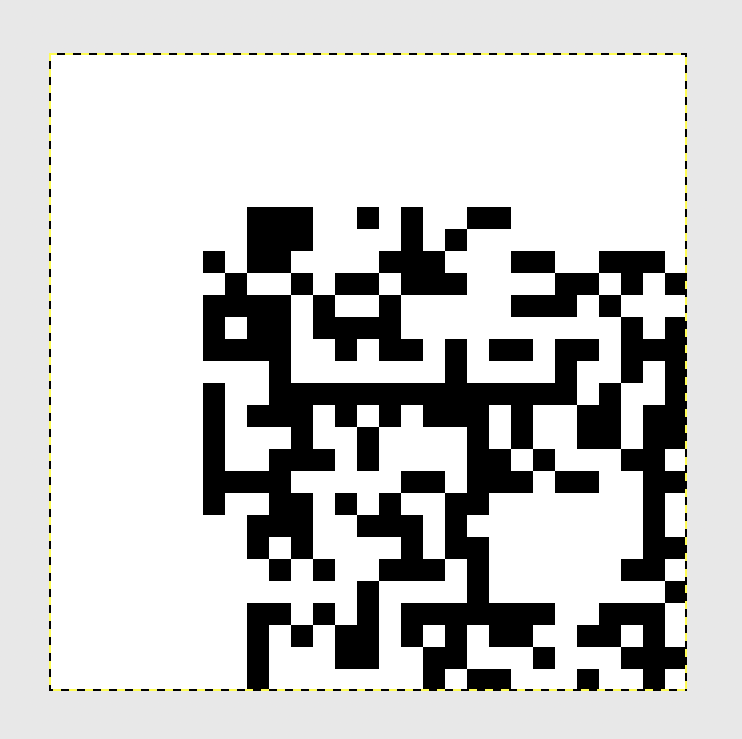
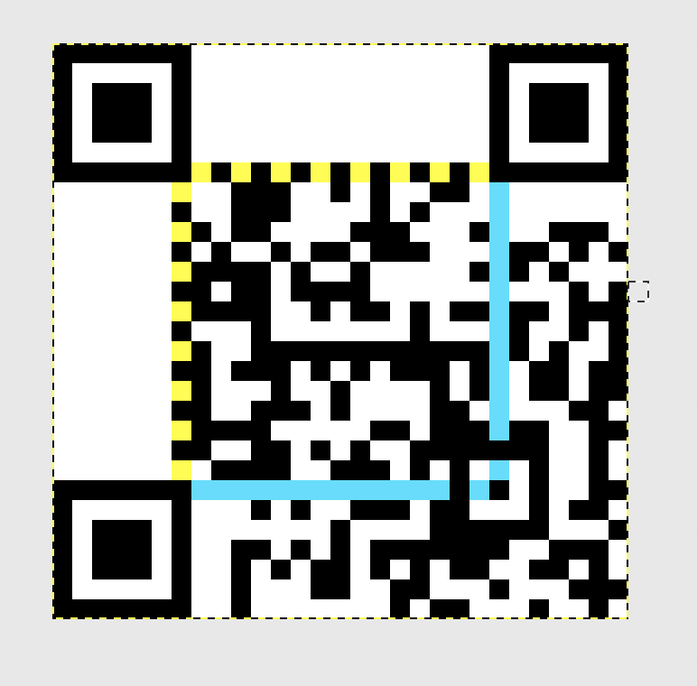

# 2D Barcode
Miscellaneous - 250 points

## Challenge 
> It's a barcode! It's in two dimensions! It's also broken!!!

> Creator - exetr

001110011100111.png

## Solution

Refer to [The Mooncake Box - GryphonCTF 2017](https://github.com/zst123/gryphonctf-2017-writeups/tree/master/Solved/The_Mooncake_Box)...

#### 1. Get Information

- Filename is the 15-bit format string: `001110011100111`
- The image is `464px * 464px`
- Each QR-pixel is `16px * 16px`
- Hence, the QR-code is 29x29 (`464px / 16px = 19`)

#### 2. Static Patterns

These are the static patterns which are always present, regardless of the data...

- Position Patterns: in the 3 corners (a 7x7 border with a 3x3 black square).
- Timing Patterns: strip of alternating pixels
- Alignment Pattern: in the bottom-right (5x5 border with 1x1 black square, and 4 pixels gap from bottom-right corner)
- Dark Module: a pixel that's always black

---

In GIMP, place the image into the canvas of 29px * 29px in raw pixel size (Scale image with `Interpolation: None` to prevent fuzzy images)

Next, add the above patterns 

#### 3. Format String

Since the format string is the same as in [The Mooncake Box - GryphonCTF 2017](https://github.com/zst123/gryphonctf-2017-writeups/tree/master/Solved/The_Mooncake_Box), I'll be reusing it directly.

Add the format string in...

And we are done

## Flag

Scan the final QR code

	GCTF{2d_r33d_s0l0m0n}
