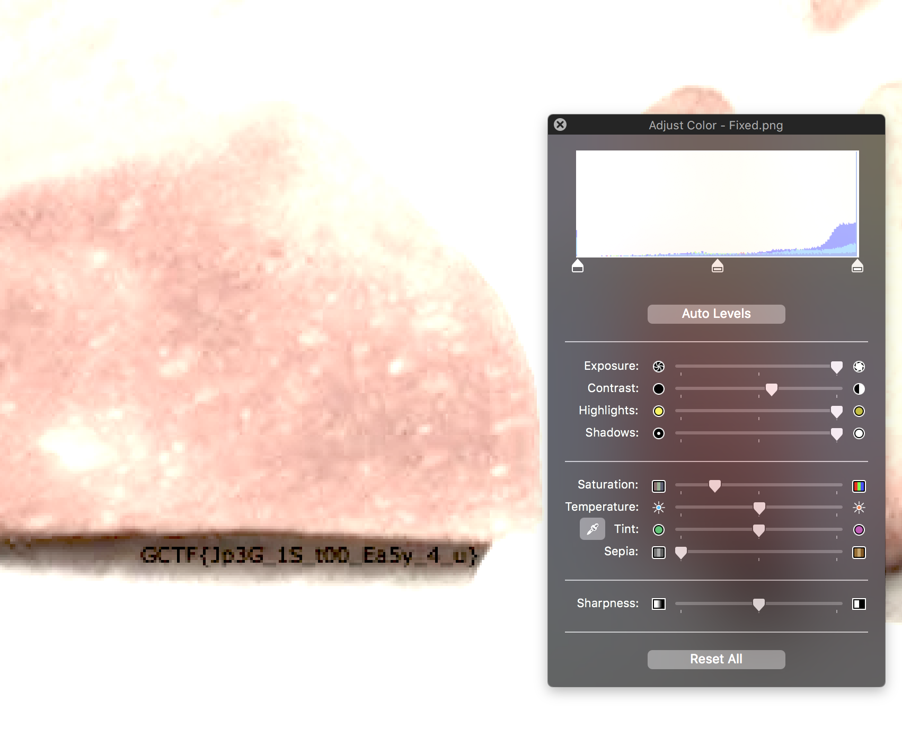

# Corrupted Download
Forensics - 50 points

## Challenge 
> I wanted to see how a cinnamon roll looks like, so what better way than to download it! But something went wrong when I was downloading it and I can't view the image. I think it may be corrupted or something. Help me see my cinnamon roll and I'll reward you for it!

Creator - whoami

## Solution

We merely need to fix the [JPG header signature](http://www.file-recovery.com/jpg-signature-format.htm)

Sneakily, the flag in hidden in the bottom right of the image. Some image enhancement must be done to make it visible.

## Flag

	GCTF{Jp3G_1S_t00_Ea5y_4_u}
