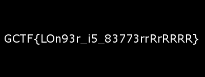

# Shorty
Cryptography - 275 points

## Challenge 
> Nothing good happens when your key length is too short, especially for XOR...

> Creator - PotatoDrug

## Solution

With the standard PNG header, XOR it together with the encrypted PNG file.

	png_header b'\x89PNG\r\n\x1a\n\x00\x00\x00\rIHDR\x00'
	key b';\xe1\xbcsz\xf9\xc1b&\xb2]%g\xcc"\x04;'

	png_header 89504e470d0a1a0a0000000d4948445200
	key 3be1bc737af9c16226b25d2567cc22043b

From inspection, we notice that key barely repeats at `0x3b`. Hence, I'll be assuming the key is 16 bytes long.

After this, do a cyclic key XOR to obtain back the original image.

## Flag

